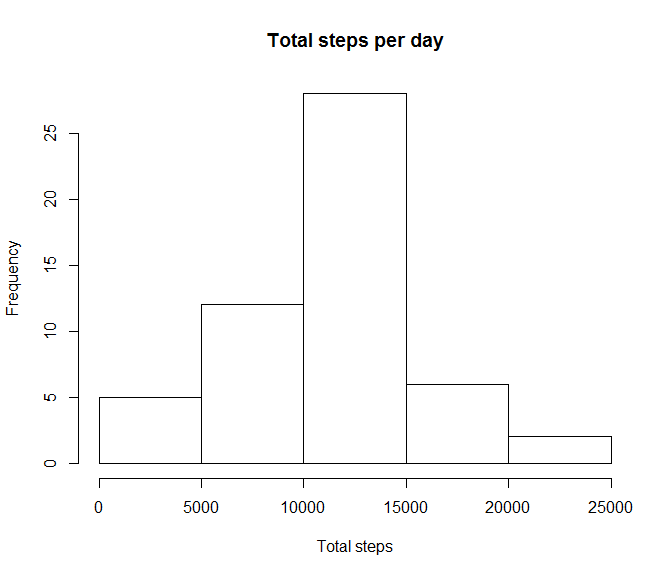

# PA1_template.Rmd

#Introduction

It is now possible to collect a large amount of data about personal movement 
using activity monitoring devices such as a Fitbit, Nike Fuelband, or Jawbone Up. These type of devices are part of the "quantified self" movement - a group of enthusiasts who take measurements about themselves regularly to improve their health, to find patterns in their behavior, or because they are tech geeks. But these data remain under-utilized both because the raw data are hard to obtain and there is a lack of statistical methods and software for processing and interpreting the data.

This assignment makes use of data from a personal activity monitoring device. This device collects data at 5 minute intervals through out the day. The data consists of two months of data from an anonymous individual collected during the months of October and November, 2012 and include the number of steps taken in 5 minute intervals each day.

#Data

The data for this assignment can be downloaded from the course web site:

Dataset: Activity monitoring data [52K]
The variables included in this dataset are:

- steps: Number of steps taking in a 5-minute interval (missing values are coded as NA)
- date: The date on which the measurement was taken in YYYY-MM-DD format
- interval: Identifier for the 5-minute interval in which measurement was taken

The dataset is stored in a comma-separated-value (CSV) file and there are a 
total of 17,568 observations in this dataset.

###1.Let's read the dataset into a dataframe calles "datact"


```r
datact <- read.csv("activity.csv")
## duplicate the data into a new dataframe for future use ...
datact2 <- datact
## ..and let's clean up <datact> by removing rows with NA for 'steps'
datact <- datact[!is.na(datact$steps),]
```

###2. Calculate the mean total number of steps taken per day, draw the histogram of
total steps taken each day


```r
require(graphics)
require(dplyr)
```

```
## Loading required package: dplyr
## 
## Attaching package: 'dplyr'
## 
## The following object is masked from 'package:stats':
## 
##     filter
## 
## The following objects are masked from 'package:base':
## 
##     intersect, setdiff, setequal, union
```

```r
m_tot<- summarize(group_by(datact, date),"total_steps"=sum(steps))
```


```r
hist(m_tot$total_steps, main="Total steps per day", xlab="Total steps")
```

 


```r
mean_total <- mean(m_tot$total_steps)
med_total <- median(m_tot$total_steps)
```

Total number of steps per day **mean = 1.0766189\times 10^{4}** while the **median = 10765**

###3. Display average daily activity pattern as a time series plot


###4. Inputing missing values

```r
NA_Tot <- sum(is.na(datact2$steps))
```

The total number of **missing values = 2304**

Now let's fill in the missing values with the mean for the day


... then, let's display a histogram of the total number of steps taken each day 


..and finally, let's calculate the mean and median total number of steps taken per day.


Total number of steps taken per day:

- MEAN    : without NA values 1.0766189\times 10^{4} same as with inputed mean values []
- MEDIAN  : without NA values 10765 same as with inputed median values []

###Conclusion:

The impact of inputing missing data on the estimates of the total daily number 
of steps is :
